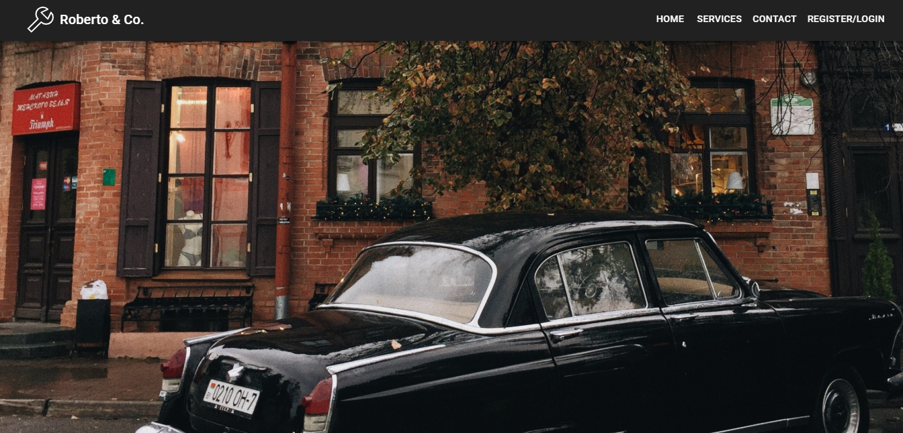
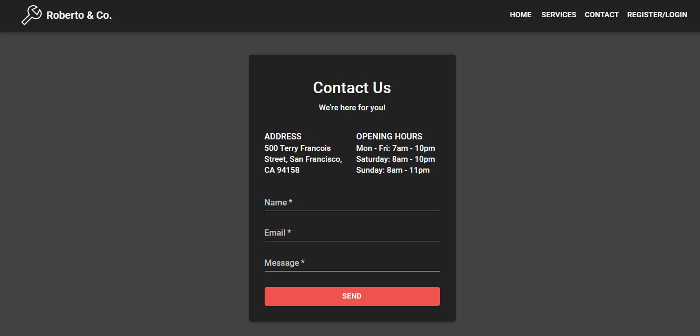
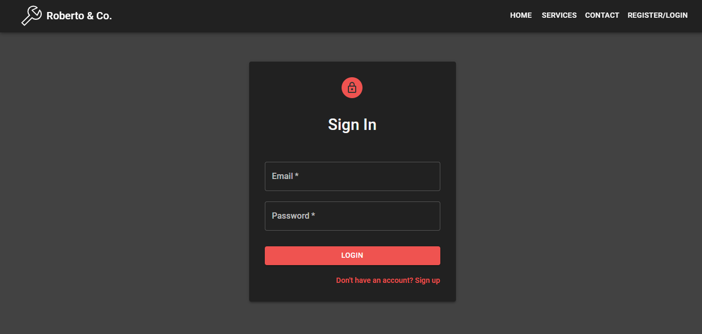
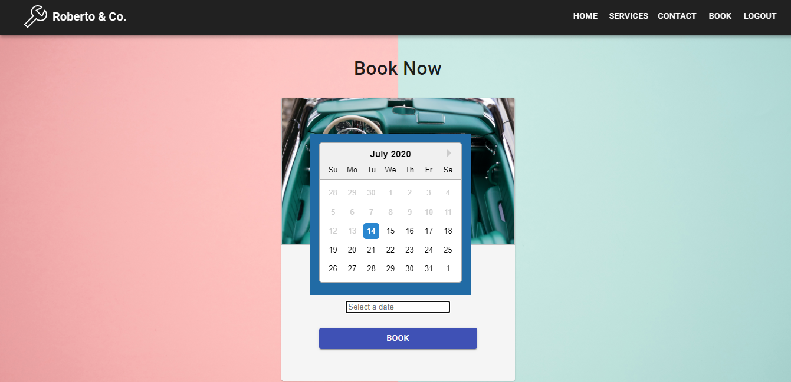

# Roberto-Garage
A responsive. full stack web application built for the purpose of booking repair consultations for vintage cars. This was developed using MERN stack (MongoDB, Express, ReactJS, NodeJS). UI Design developed using Material UI. 

## Screenshots

